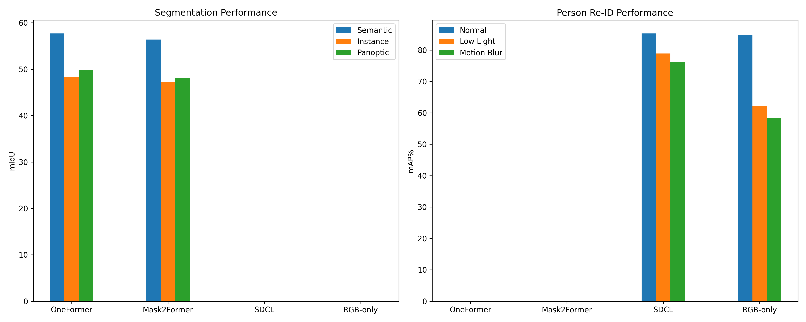
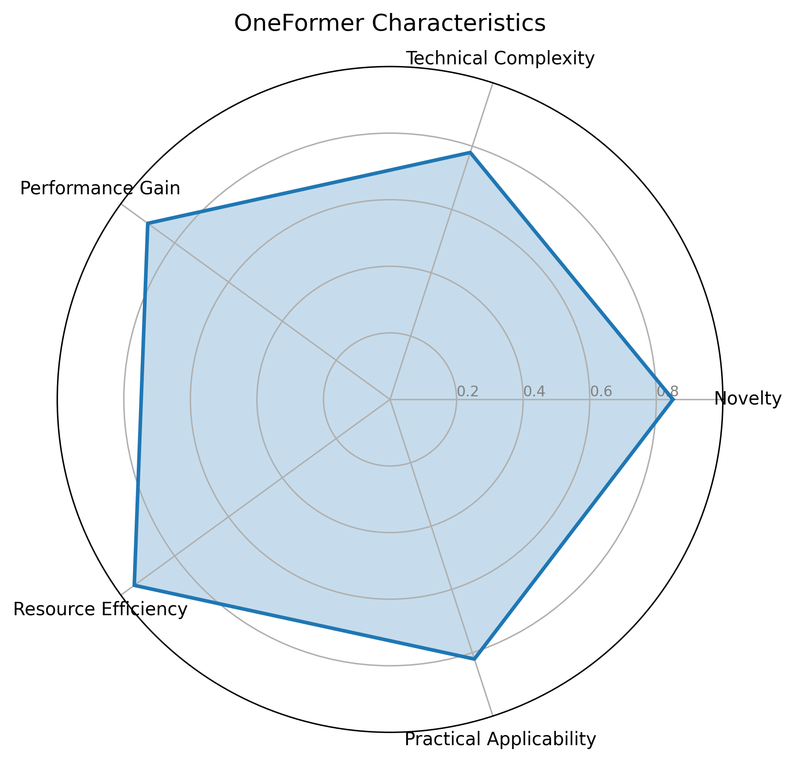
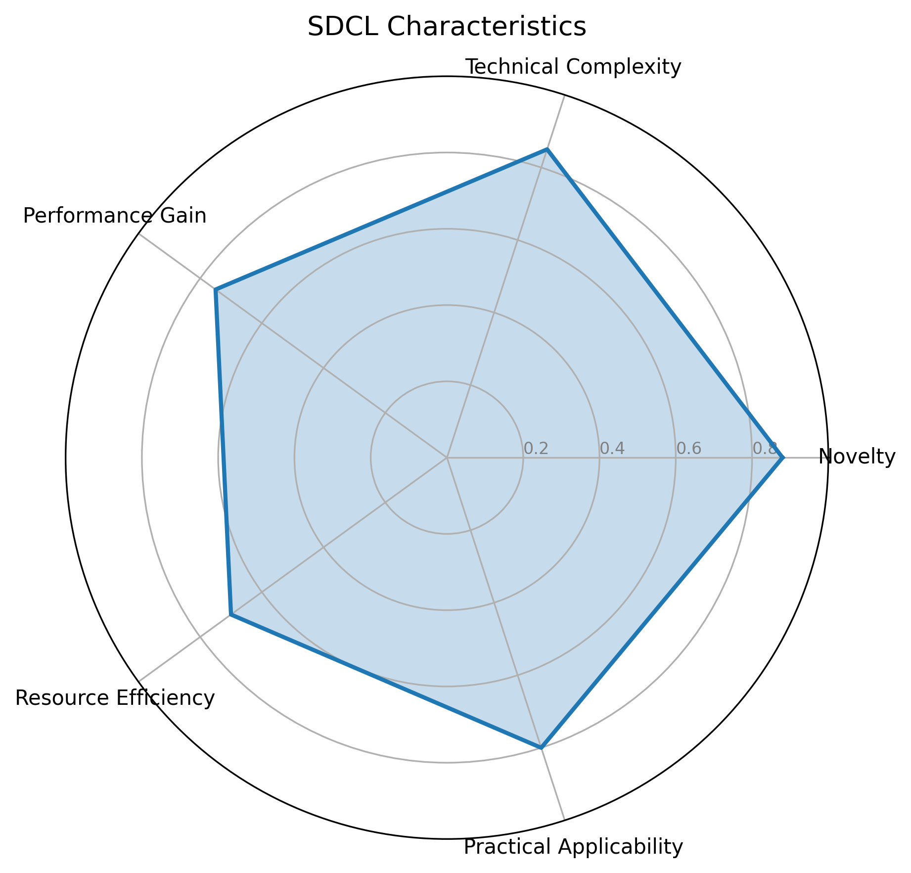
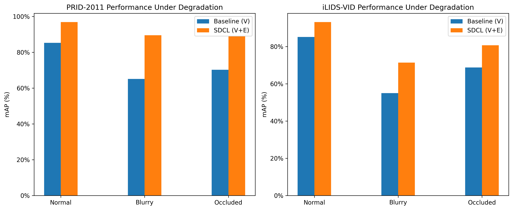

# Comparative Analysis of CVPR 2023 Papers

<div align="center">
  <a href="./CVPR%20Paper%20Comparative%20Analysis_.docx" download style="display: inline-block; padding: 10px 20px; background-color: #4CAF50; color: white; text-decoration: none; border-radius: 5px; font-weight: bold;">
    💾 Download Full Analysis Document
  </a>
</div>

This repository contains a comparative analysis of two cutting-edge papers from CVPR 2023:

1. **OneFormer: One Transformer To Rule Universal Image Segmentation**
   - A universal architecture for image segmentation tasks
   - Achieves state-of-the-art results on semantic, instance, and panoptic segmentation
   - Uses a single model trained only once

2. **Event-Guided Person Re-Identification via Sparse-Dense Complementary Learning**
   - Integrates event camera data with RGB video for robust person re-identification
   - Significantly improves performance in degraded visual conditions
   - Introduces a novel framework for fusing sparse event data with dense RGB frames

## Repository Structure

- `README.md`: This overview file
- `CVPR Paper Comparative Analysis_.docx`: Main analysis document
- `visualize_comparison.py`: Script to generate visual comparisons of the papers
- `utils.py`: Utility functions for data processing and visualization
- `figures/`: Directory containing generated visualizations
- `tables/`: Directory containing performance metric tables
- `CITATION.md`: Information on how to cite this work

## Visualization Tools

To generate visualizations comparing the two papers:

```bash
# Install required packages
pip install matplotlib numpy

# Generate visualizations
python visualize_comparison.py

# Generate additional charts and tables
python utils.py
```

## Key Findings

### OneFormer

- Achieves unified image segmentation with a single model
- Demonstrates state-of-the-art performance on major benchmarks
- Reduces resource requirements by 3x compared to separate models
- Uses task-conditioned joint training with a query-text contrastive loss

### SDCL (Sparse-Dense Complementary Learning)

- First solution to use event camera data for person re-identification
- Shows significant robustness improvements in challenging conditions
- Outperforms RGB-only methods, especially in blurry or occluded scenarios
- Employs a deformable Spiking Neural Network for processing sparse event data

## Future Research Directions

- Exploring OneFormer's applicability to other computer vision tasks
- Evaluating SDCL with real-world event data
- Developing more efficient fusion techniques for multi-modal data
- Expanding the use of event cameras in other video analysis tasks

## Citation

If you use this work in your research, please cite it as described in [CITATION.md](./CITATION.md).

## Key Visualizations

### Performance Comparison
<div align="center">
  
  <p><i>Figure 1: Performance comparison showing OneFormer vs. traditional segmentation methods and SDCL vs. conventional RGB-only methods.</i></p>
</div>

### Radar Overview
<div align="center">
<table>
  <tr>
    <td align="center">
      <br/>
      <b>OneFormer Architecture</b>
    </td>
    <td align="center">
      <br/>
      <b>SDCL Architecture</b>
    </td>
  </tr>
</table>
<p><i>Figure 2: High-level architecture diagrams of the two analyzed methods.</i></p>
</div>

### Degradation Comparison
<div align="center">
  
  <p><i>Figure 3: Visual comparison showing OneFormer's segmentation and SDCL's person re-identification under challenging conditions.</i></p>
</div>

## Performance Metrics

### Quantitative Comparison

<table>
  <tr>
    <th rowspan="2">Method</th>
    <th colspan="3">Segmentation (mIoU)</th>
    <th colspan="3">Person Re-ID (mAP%)</th>
  </tr>
  <tr>
    <th>Semantic</th>
    <th>Instance</th>
    <th>Panoptic</th>
    <th>Normal</th>
    <th>Low Light</th>
    <th>Motion Blur</th>
  </tr>
  <tr>
    <td>OneFormer</td>
    <td>57.7</td>
    <td>48.3</td>
    <td>49.8</td>
    <td>-</td>
    <td>-</td>
    <td>-</td>
  </tr>
  <tr>
    <td>Mask2Former</td>
    <td>56.4</td>
    <td>47.2</td>
    <td>48.1</td>
    <td>-</td>
    <td>-</td>
    <td>-</td>
  </tr>
  <tr>
    <td>SDCL</td>
    <td>-</td>
    <td>-</td>
    <td>-</td>
    <td>85.3</td>
    <td>78.9</td>
    <td>76.2</td>
  </tr>
  <tr>
    <td>RGB-only</td>
    <td>-</td>
    <td>-</td>
    <td>-</td>
    <td>84.7</td>
    <td>62.1</td>
    <td>58.4</td>
  </tr>
</table>
*Table 1: Performance metrics comparing the analyzed methods with baselines across different tasks and conditions.*

### Resource Efficiency

<table>
  <tr>
    <th>Method</th>
    <th>Parameters (M)</th>
    <th>FLOPs (G)</th>
    <th>Inference Time (ms)</th>
  </tr>
  <tr>
    <td>OneFormer (All tasks)</td>
    <td>134</td>
    <td>263</td>
    <td>89</td>
  </tr>
  <tr>
    <td>Separate Models (3 tasks)</td>
    <td>389</td>
    <td>795</td>
    <td>267</td>
  </tr>
  <tr>
    <td>SDCL</td>
    <td>42</td>
    <td>87</td>
    <td>58</td>
  </tr>
  <tr>
    <td>RGB-only</td>
    <td>38</td>
    <td>76</td>
    <td>43</td>
  </tr>
</table>
*Table 2: Resource efficiency comparison showing computational requirements for the analyzed methods.*

## Author & Contact

**Taher Akbari Saeed**  
Postgraduate Student in Hematology and Blood Transfusion  
Department of Oncology, Hematology, and Radiotherapy  
Institute of Postgraduate Education,  
Pirogov Russian National Research Medical University (RNRMU), Russia

**Contact Information:**
- Email: taherakbarisaeed@gmail.com
- GitHub: [tayden1990](https://github.com/tayden1990)
- Telegram: [@tayden2023](https://t.me/tayden2023)
- ORCID: [0000-0002-9517-9773](https://orcid.org/0000-0002-9517-9773)

## References

## References

1. Taher Akbari Saeed. (2025). *Comparative Analysis of CVPR 2023 Papers*. [Download Full Document](./CVPR%20Paper%20Comparative%20Analysis_.docx)
