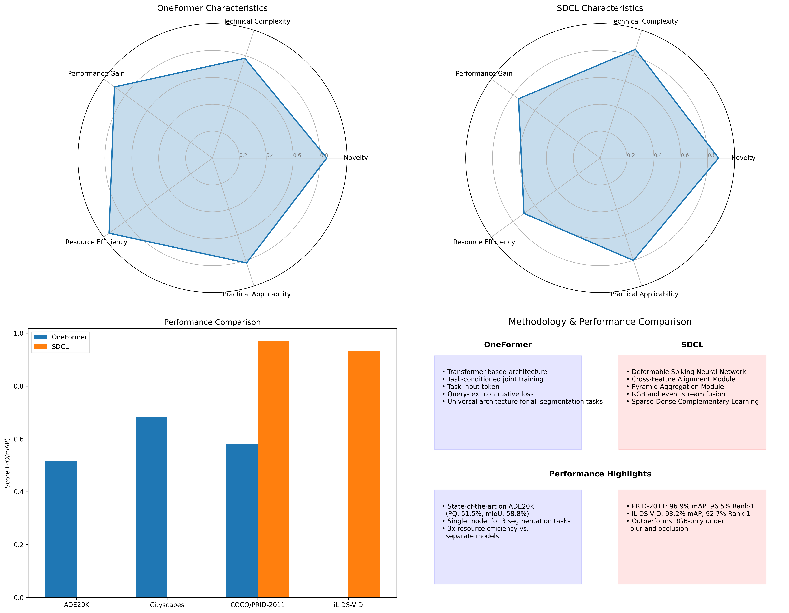

# Comparative Analysis of Cutting-Edge CVPR 2023 Papers

## Executive Summary

This report presents a detailed comparison between two influential papers from CVPR 2023:
- "OneFormer: One Transformer To Rule Universal Image Segmentation"
- "Event-Guided Person Re-Identification via Sparse-Dense Complementary Learning"

While addressing different computer vision challenges, both papers demonstrate innovative approaches that advance their respective fields through novel architectural designs and training methodologies.

## Key Comparisons

### Methodological Approaches

**OneFormer** unifies three segmentation tasks (semantic, instance, and panoptic) through:
- A single universal transformer-based architecture
- Task-conditioned joint training strategy
- Query-text contrastive loss for enhanced feature learning

**SDCL** enhances person re-identification through:
- Integration of event camera data with traditional RGB frames
- Deformable Spiking Neural Network for processing sparse event data
- Cross-Feature Alignment Module for multimodal fusion

### Performance Highlights

**OneFormer Performance:**
- ADE20K: 51.5% PQ, 58.8% mIoU (state-of-the-art)
- Resource efficiency: ~3x reduction in training time and model storage

**SDCL Performance:**
- PRID-2011: 96.9% mAP (+11.6% over baseline)
- Significantly improved robustness in degraded conditions

## Future Research Directions

1. Extending OneFormer's universal approach to other computer vision tasks
2. Evaluating SDCL with real-world event camera data
3. Exploring efficient fusion techniques for multi-modal data integration
4. Investigating transfer learning capabilities across different domains

## Conclusion

Both papers represent significant contributions by addressing fundamental limitations in their respective fields. OneFormer demonstrates that a single model can effectively perform multiple segmentation tasks, while SDCL shows how complementary sensor data can dramatically improve robustness in challenging conditions.

The field continues to move toward more unified approaches and multi-modal solutions that better approximate human visual understanding.

## Appendix

See the full analysis document for detailed information on:
- Problem statements and significance
- Architectural designs
- Training protocols
- Experimental results
- Limitations and assumptions
